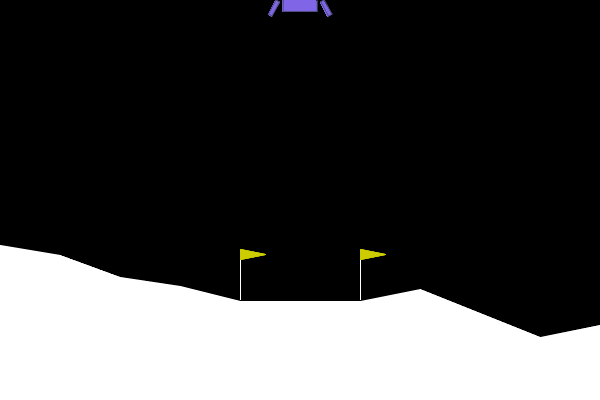
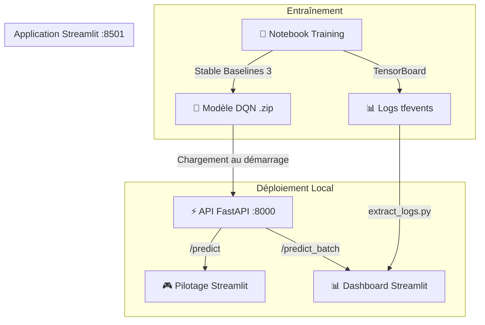
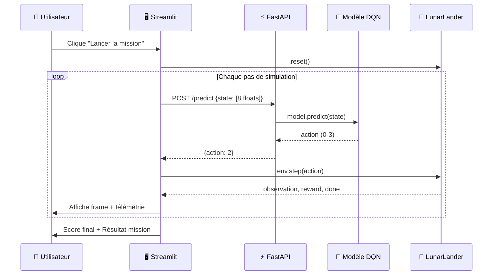
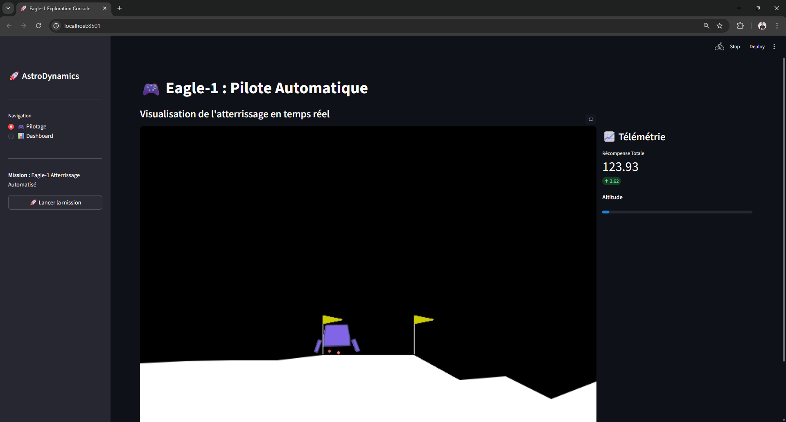
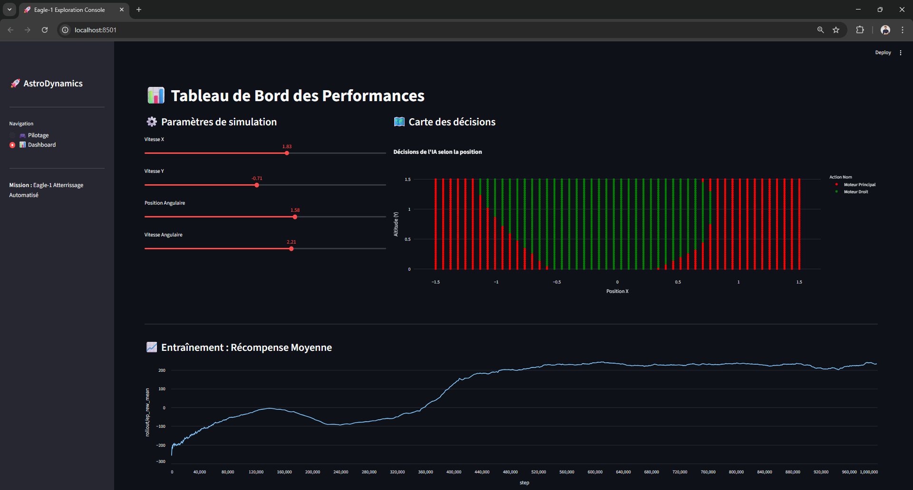

# 🚀 AstroDynamics — Eagle-1 Atterrissage Automatisé

[](https://www.python.org/)
[](https://fastapi.tiangolo.com/)
[](https://streamlit.io/)
[](https://stable-baselines3.readthedocs.io/)
[](https://pytorch.org/)
[](https://gymnasium.farama.org/)

> **Dépôt GitHub recommandé :** [`DQN-LunarLander-FastAPI-Streamlit`](https://github.com/RandomFab/DQN-LunarLander-FastAPI-Streamlit)

**Entraînement et déploiement d'un agent DQN (Deep Q-Network) capable d'atterrir de manière autonome sur la surface lunaire, dans l'environnement `LunarLander-v3` de Gymnasium.**

<p align="center">
  
</p>

---

## 🎯 Objectif du projet

Ce projet explore l'**apprentissage par renforcement** (Reinforcement Learning) appliqué au contrôle d'un vaisseau spatial. Un agent DQN apprend, par essais-erreurs, à maîtriser ses réacteurs pour se poser en douceur sur un pad d'atterrissage.

Le projet comprend :
- Un **notebook d'entraînement** avec optimisation systématique des hyperparamètres
- Une **API FastAPI** servant le modèle entraîné pour l'inférence
- Une **application Streamlit** permettant de visualiser l'agent en action et d'explorer ses décisions

---

## ✨ Fonctionnalités

- ✅ Entraînement d'un agent DQN avec **Stable Baselines 3** et suivi via **TensorBoard**
- ✅ Optimisation séquentielle de 4 hyperparamètres : Learning Rate, Exploration Fraction, Gamma, Buffer Size
- ✅ API REST pour l'inférence unitaire (`/predict`) et en batch (`/predict_batch`)
- ✅ Interface Streamlit avec **pilotage en temps réel** et **télémétrie** (score, altitude)
- ✅ **Carte de décisions interactive** (Policy Map) : visualisation des actions de l'IA selon la position du vaisseau avec des sliders pour les paramètres dynamiques
- ✅ Courbe d'apprentissage extraite directement des logs TensorBoard via Pandas

---

## 📊 Architecture du projet





---

## 📁 Structure des Fichiers

```
AstroDynamics/
│
├── 📂 src/
│   ├── 🎨 app/                    # Interface utilisateur Streamlit
│   │   ├── app.py                 # Point d'entrée + routage des pages
│   │   ├── interface.py           # Page Pilotage : simulation en temps réel
│   │   └── dashboard.py           # Page Dashboard : carte de décisions + courbe d'apprentissage
│   │
│   ├── ⚡ api/                    # API REST FastAPI
│   │   ├── main.py                # Routes : /health, /predict, /predict_batch, /model_status
│   │   └── schemas.py             # Schémas Pydantic (Observation, PredictionResponse)
│   │
│   ├── 🧠 model/                  # Service métier du modèle
│   │   └── model_service.py       # Chargement DQN + inférence
│   │
│   └── 🔧 scripts/                # Utilitaires
│       └── extract_logs.py        # Extraction des logs TensorBoard → Pandas DataFrame
│
├── 📂 config/
│   └── logger.py                  # Configuration du logging
│
├── 📂 data/
│   └── 📂 model/                  # Modèles entraînés (.zip Stable Baselines 3)
│       ├── dqn_lunarlander_best_HP.zip
│       ├── dqn_lunarlander_lr_*.zip
│       ├── dqn_lunarlander_ef_*.zip
│       ├── dqn_lunarlander_g_*.zip
│       └── dqn_lunarlander_bs_*.zip
│
├── 📂 logs/
│   └── 📂 dqn_LunarLander_v1/    # Logs TensorBoard par run
│       ├── Baseline_1/
│       ├── best_HP_1/
│       ├── lr_*/ ef_*/ g_*/ bs_*/
│       └── ...
│
├── 📂 notebooks/
│   ├── Training_model.ipynb       # Notebook principal : exploration, entraînement, optimisation HP
│   └── EDA_info_best_HP.ipynb     # Analyse des logs du meilleur modèle
│
├── 📂 images/                     # Visuels pour le README
│   ├── landing_demo.gif           # GIF de l'atterrissage autonome
│   ├── interface_pilotage.png     # Capture de l'interface de pilotage
│   └── dashboard_policy_map.png   # Capture du dashboard et de la carte de décisions
│
├── pyproject.toml                 # Dépendances et configuration du projet (uv)
├── uv.lock                       # Lockfile des dépendances
└── .python-version                # Python 3.13
```

---

## Lancement Rapide (VS Code)

Ce projet inclut des **tâches VS Code** pour un démarrage simplifié.

1.  Ouvrez la palette de commandes : `Ctrl+Shift+P` (ou `Cmd+Shift+P` sur Mac).
2.  Tapez `Tasks: Run Task`.
3.  Choisissez l'une des tâches suivantes :
    - `Start API` : Lance le serveur FastAPI sur `http://localhost:8000`.
    - `Start Streamlit` : Lance l'application Streamlit sur `http://localhost:8501`.

Les services démarreront dans des terminaux intégrés.

---

## Le Notebook d'Entraînement

Le fichier `notebooks/Training_model.ipynb` suit un pipeline structuré :

### 1. Exploration de l'environnement
- Création de l'environnement `LunarLander-v3` (version discrète, 4 actions)
- Documentation du vecteur d'état (8 dimensions) et du système de récompenses

### 2. Entraînement Baseline
- Modèle DQN initial avec hyperparamètres par défaut
- Score de référence : **-102 ± 139** (le vaisseau s'écrase systématiquement)

### 3. Optimisation des Hyperparamètres
Chaque hyperparamètre est optimisé séquentiellement sur **300 000 timesteps** :

| Hyperparamètre | Valeurs testées | Meilleure valeur |
|:---|:---|:---|
| Learning Rate | 1e-1, 1e-2, 1e-4, 1e-5 | **1e-3** (baseline) |
| Exploration Fraction | 0.1, 0.4, 0.7, 0.9 | **0.2** |
| Gamma | 0.8, 0.9, 0.95, 0.97 | **0.99** (baseline) |
| Buffer Size | 10k, 50k, 100k, 500k | **100 000** |

### 4. Entraînement final
- Modèle `best_HP` entraîné sur **1 000 000 timesteps** avec les meilleurs hyperparamètres
- Évaluation sur 100 épisodes en mode déterministe

### 5. Visualisation
- Affichage de l'agent en action via une fenêtre Pygame (`render_mode='human'`)

---

## ⚡ API FastAPI

L'API charge le modèle DQN au démarrage via le mécanisme `lifespan` de FastAPI.

### Endpoints disponibles

| Méthode | Route | Description |
|:---|:---|:---|
| `GET` | `/health` | Vérification de l'état de l'API |
| `GET` | `/model_status` | Vérifie si le modèle est chargé en mémoire |
| `POST` | `/load_model` | Rechargement manuel du modèle |
| `POST` | `/predict` | Prédiction d'une action à partir d'un vecteur d'état (8 floats) |
| `POST` | `/predict_batch` | Prédiction en batch (optimisé numpy, idéal pour la carte de décisions) |

### Exemple d'appel

```bash
curl -X POST http://localhost:8000/predict \
  -H "Content-Type: application/json" \
  -d '{"state": [0.12, 1.45, 0.0, -0.1, 0.05, 0.0, 0, 0]}'
```

**Réponse :**
```json
{"action": 2}
```

> Actions : `0` = Rien, `1` = Moteur Gauche, `2` = Moteur Principal, `3` = Moteur Droit

---

## 🖥️ Application Streamlit

L'application comporte deux pages accessibles via la barre latérale :

### 🎮 Pilotage
- Simulation en temps réel de l'atterrissage
- Rendu vidéo de l'environnement LunarLander directement dans le navigateur
- Télémétrie en direct : récompense totale, barre d'altitude
- Résultat de mission avec animation (ballons si score ≥ 200)

<p align="center">
  
</p>

### 📊 Dashboard
- **Carte de décisions interactive** : grille 50×50 de positions (x, y) colorée par action prédite
- **Sliders dynamiques** : vitesse X/Y, position angulaire, vitesse angulaire pour explorer la politique de l'agent
- **Courbe d'apprentissage** : récompense moyenne au fil de l'entraînement (extraite des logs TensorBoard)

<p align="center">
  
</p>

---

## 🚀 Installation & Lancement

### Prérequis

- Python **3.13+**
- [uv](https://docs.astral.sh/uv/) (gestionnaire de paquets)

### Installation

```bash
# Cloner le dépôt
git clone <url-du-repo>
cd AstroDynamics

# Installer les dépendances
uv sync
```

### Lancement

L'application nécessite **deux processus** en parallèle :

```bash
# Terminal 1 : Démarrer l'API (port 8000)
uv run uvicorn src.api.main:api --reload

# Terminal 2 : Démarrer Streamlit (port 8501)
uv run streamlit run src/app/app.py
```

Puis ouvrir [http://localhost:8501](http://localhost:8501) dans le navigateur.

### TensorBoard (optionnel)

```bash
uv run python -m tensorboard.main --logdir logs/dqn_LunarLander_v1
```

---

## 🧪 Conclusions

- L'agent DQN parvient à **atterrir de manière fiable** avec un score moyen supérieur à 200, ce qui qualifie l'environnement comme "résolu"
- L'optimisation séquentielle des hyperparamètres montre que le **Learning Rate** (1e-3) et le **Gamma** (0.99) de la baseline étaient déjà optimaux, tandis que l'**Exploration Fraction** (0.2) et le **Buffer Size** (100k) ont été affinés
- L'entraînement prolongé à **1 million de timesteps** permet une convergence stable de la politique
- La **carte de décisions** révèle que l'agent utilise principalement le moteur principal en altitude et les moteurs latéraux pour corriger sa trajectoire horizontale

---

## Auteur

**RandomFab** — Fabien BARDOUIL
